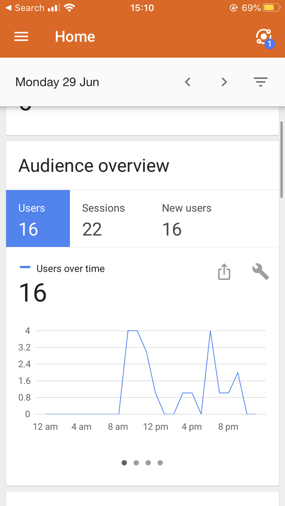
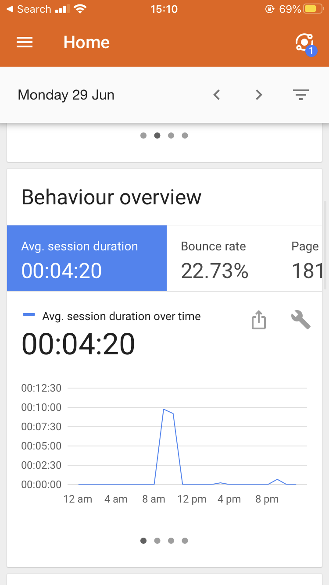

# Guardian News Summary App

I decided to heavily concentrate on planning before attempting this weekend challenge.

Prior to writing any code, I played around with the guardian api, to see what it was capable of and what parameters it required etc. It's documentation can be viewed at the following link:
https://open-platform.theguardian.com/documentation/

I spent friday morning looking into promises and async functions, concentrating on the use of await that was brought out in ES6. This allowed me to use the fetch keyword instead of XML request.

## Deployment

I decided to deploy a BETA version of this project at the following address https://quicknews.imfast.io/

## Google Analytics

I decided to have a play around in which I built Google Analytics monitoring into the website. This can be shown below:

|                 Audience Overview                 |                Behaviour Overview                 |
| :-----------------------------------------------: | :-----------------------------------------------: |
|  |  |

## Future Work

- Having built this site after only 3 weeks of Javascript I struggled with testing asynchronous functions from Es6 and the relatively new 'fetch' command. I will be updating this projects testing to ensure strong test coverage in the following weeks. Update - this is being worked on as of now on a branch.

- On top of this there are 2 minor bugs that will be looked into in the coming weeks. One is a small outage if the api request does not contain a thumbnail image link, while the second is the appearance of commas in the article summaries.
